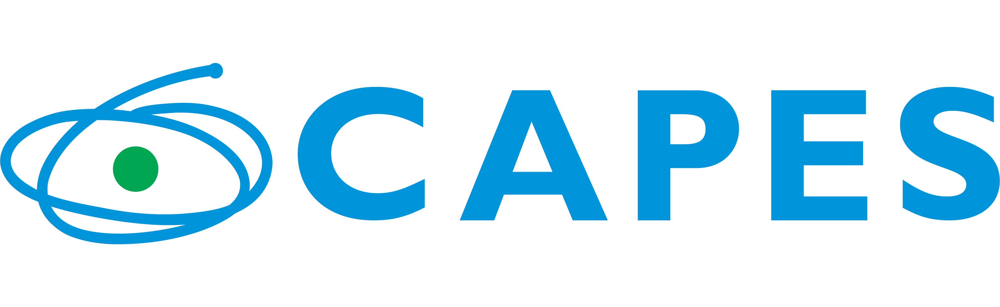
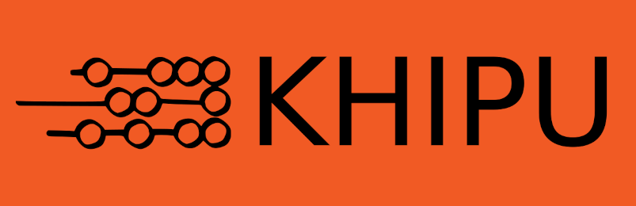

(ackmap)=
# Acknowledgments

(ackmap:help)=
## Inspiration
This book is largely inspired on the ISMIR tutorial on [`Tempo, Beat and Downbeat Tracking`](https://tempobeatdownbeat.github.io/tutorial/intro.html), both from an aesthetic and structural point of view.

(ackmap:tools)=
## Existing tools
This tutorial also makes considerable use of the following
existing MIR tools.

* `mirdata` [Github Link](https://github.com/mir-dataset-loaders/mirdata)
* `mir_eval` [Github Link](https://github.com/craffel/mir_eval)
* `librosa` [Github Link](https://github.com/librosa/librosa)
* `madmom` [Github Link](https://github.com/CPJKU/madmom)

(ackmap:funding)=
## Funding 
This work is funded by the Google through the Award for Inclusion Research Program, and by the Coordination for the Improvement of Higher Education Personnel – Brazil (CAPES). The LAMIR workshop is possible due to the generous support of our sponsors: the ISMIR board, Khipux, CAPES, Google and MusicAI.

